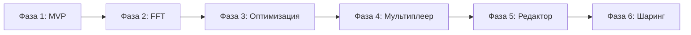

# План задач проекта isocubic

Данный документ является индексом всех задач проекта isocubic. Подробное описание каждой фазы находится в соответствующих файлах директории [docs/phases/](docs/phases/).

---

## Структура документации

```
TASKS.md (этот файл)      — Индекс задач
ROADMAP.md                — Обзор roadmap проекта
docs/phases/
├── phase-1-mvp.md        — Фаза 1: MVP
├── phase-2-fft.md        — Фаза 2: FFT для магических объектов
├── phase-3-optimization.md — Фаза 3: Оптимизация
├── phase-4-multiplayer.md  — Фаза 4: Мультиплеер
├── phase-5-editor.md     — Фаза 5: Расширение редактора
└── phase-6-sharing.md    — Фаза 6: Публикация и шаринг
```

---

## Обзор фаз

### [Фаза 1: MVP](docs/phases/phase-1-mvp.md)

**Цель**: Создать минимально жизнеспособный продукт — веб-редактор одного параметрического кубика.

**Статус**: ✅ Завершена

| ISSUE | Название | Статус |
|-------|----------|--------|
| 1 | Инициализация проекта | ✅ |
| 2 | JSON-схема SpectralCube | ✅ |
| 3 | GLSL-шейдер | ✅ |
| 4 | CubePreview | ✅ |
| 5 | ParamEditor | ✅ |
| 6 | TinyLLM | ✅ |
| 7 | Сшивка границ | ✅ |
| 8 | Экспорт/импорт | ✅ |
| 9 | Галерея | ✅ |
| 10 | Мобильная оптимизация | ✅ |
| 11 | Тестирование | ✅ |
| 12 | Деплой | ✅ |

---

### [Фаза 2: FFT для магических объектов](docs/phases/phase-2-fft.md)

**Цель**: Добавить поддержку FFT-подхода для создания магических объектов с динамическими эффектами.

**Статус**: ✅ Завершена

| ISSUE | Название | Статус |
|-------|----------|--------|
| 13 | WASM-модуль для FFT | ✅ |
| 14 | Шейдер энергии | ✅ |
| 15 | Физика энергии | ✅ |
| 16 | Бой и разрушение | ✅ |

---

### [Фаза 3: Оптимизация](docs/phases/phase-3-optimization.md)

**Цель**: Оптимизировать производительность и добавить продвинутые возможности.

**Статус**: ✅ Завершена

| ISSUE | Название | Статус |
|-------|----------|--------|
| 17 | LOD-система | ✅ |
| 18 | WebGPU compute | ✅ |
| 19 | Расширенный ИИ | ✅ |
| 20 | Стопки кубиков | ✅ |

---

### [Фаза 4: Мультиплеер](docs/phases/phase-4-multiplayer.md)

**Цель**: Добавить поддержку совместной работы над кубиками.

**Статус**: ✅ Завершена

| ISSUE | Название | Статус |
|-------|----------|--------|
| 21 | Основы коллаборации | ✅ |
| 22 | WebSocket | ✅ |
| 23 | UI коллаборации | ✅ |
| 24 | Серверная часть | ✅ |

---

### [Фаза 5: Расширение редактора](docs/phases/phase-5-editor.md)

**Цель**: Расширить ParamEditor для поддержки всех функций из Фаз 1-4.

**Статус**: 🔄 В процессе

| ISSUE | Название | Статус |
|-------|----------|--------|
| 25 | Редактор границ | ✅ |
| 26 | FFT-редактор | ✅ |
| 27 | FFT-каналы | ✅ |
| 28 | Визуализация энергии | ✅ |
| 29 | Редактор стопок | ✅ |
| 30 | Шаблоны стопок | ✅ |
| 31 | LOD-настройки | ✅ |
| 32 | AI-интеграция | 🔄 |
| 33 | Коллаборация | 🔄 |
| 34 | Унифицированный редактор | 🔄 |

---

### [Фаза 6: Публикация и шаринг](docs/phases/phase-6-sharing.md)

**Цель**: Создать систему публикации и шаринга кубиков для сообщества.

**Статус**: 🔄 В процессе

| ISSUE | Название | Статус |
|-------|----------|--------|
| 35 | Аутентификация | 🔄 |
| 36 | Галерея сообщества | 📋 |
| 37 | Share-ссылки | 📋 |
| 38 | Социальные функции | 📋 |
| 39 | API для публикации | 📋 |

---

## Легенда статусов

| Символ | Статус |
|--------|--------|
| ✅ | Завершено |
| 🔄 | В работе |
| 📋 | Планируется |

---

## Диаграмма зависимостей фаз



---

## Приоритизация

### Критический путь
1. Фаза 1 (MVP) → Фаза 2 (FFT) → Фаза 3 (Оптимизация)

### Параллельная разработка
- После Фазы 3: Фаза 4 и Фаза 5 могут разрабатываться параллельно
- Фаза 6 зависит от завершения Фаз 4 и 5

---

## Связанные документы

- [ROADMAP.md](ROADMAP.md) — обзор roadmap проекта
- [ANALYSIS.md](ANALYSIS.md) — анализ подходов к реализации
- [description.md](description.md) — исходные идеи проекта
- [docs/API.md](docs/API.md) — API референс

---

## История изменений

- **2024**: Создан план задач для Фазы 1 (MVP)
- **2024**: Добавлены Фазы 2-4 (FFT, Оптимизация, Мультиплеер)
- **2024**: Добавлена Фаза 5 (Расширение редактора)
- **2025**: Реорганизация: разделение на отдельные файлы по фазам
