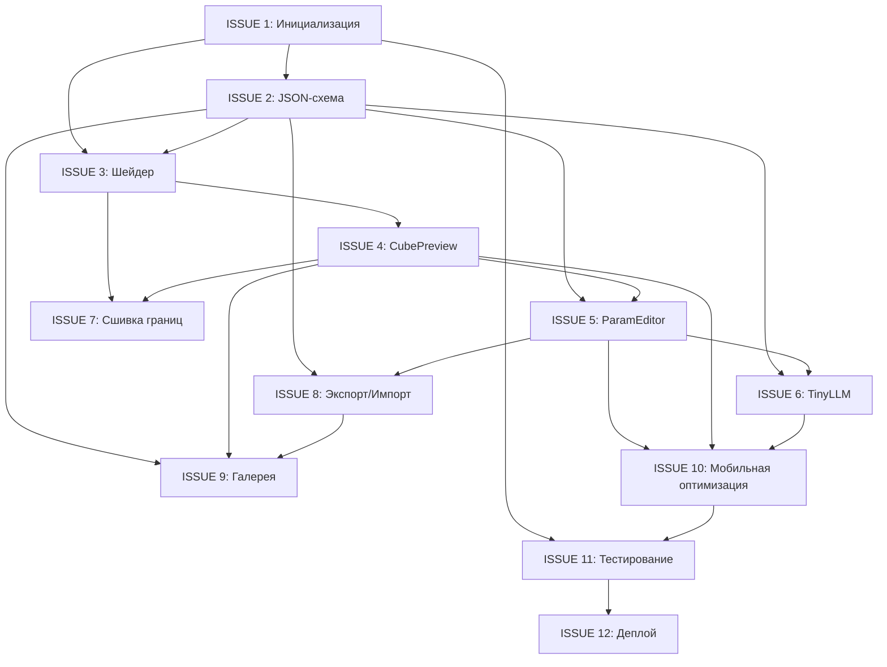
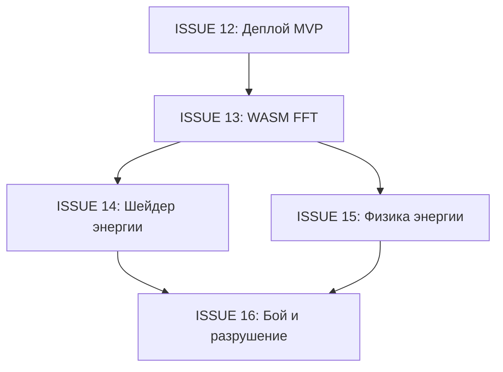
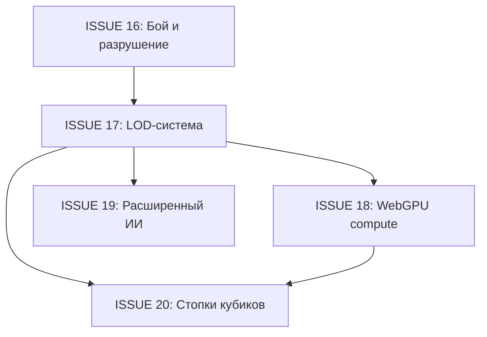

# План задач: Фаза 1 — MVP с параметрическим подходом

Данный документ содержит последовательность ISSUE для реализации веб-прототипа редактора isocubic.

---

## Обзор Фазы 1

**Цель**: Создать минимально жизнеспособный продукт (MVP) — веб-редактор одного параметрического кубика с возможностью генерации по текстовому промпту.

**Основные требования**:
- Параметрический подход (градиенты + шум)
- Производительность 60 FPS на мобильных устройствах
- Интуитивный интерфейс для художников
- Интеграция с ИИ для генерации по промпту
- Экспорт в JSON для дальнейшего использования

---

## Последовательность ISSUE

### ISSUE 1: Инициализация проекта и базовая структура

**Заголовок**: `Инициализация проекта: настройка окружения и структуры каталогов`

**Описание**:
Настроить базовую структуру веб-проекта для редактора isocubic.

**Задачи**:
- [ ] Создать React-приложение с Vite
- [ ] Настроить TypeScript
- [ ] Установить зависимости: Three.js, @react-three/fiber, @react-three/drei
- [ ] Настроить Tailwind CSS для стилизации
- [ ] Создать структуру каталогов:
  ```
  /src
    /components    # React-компоненты
    /lib           # Утилиты и хелперы
    /shaders       # GLSL-шейдеры
    /types         # TypeScript-типы
    /store         # Состояние приложения
  /public
    /model         # Файлы модели TinyLLM
  ```
- [ ] Настроить ESLint и Prettier
- [ ] Создать базовый CI/CD pipeline (GitHub Actions)

**Критерии приёмки**:
- Проект запускается командой `npm run dev`
- TypeScript компилируется без ошибок
- Отображается пустая страница с заголовком "isocubic"

**Метки**: `setup`, `infrastructure`

---

### ISSUE 2: Определение JSON-схемы для конфигурации кубика

**Заголовок**: `Создание JSON-схемы SpectralCube для параметрических кубиков`

**Описание**:
Разработать и документировать JSON-схему для хранения конфигурации параметрических кубиков.

**Задачи**:
- [ ] Создать файл `/src/types/cube-schema.json` с JSON Schema Draft-07
- [ ] Определить основные свойства:
  - `id` — уникальный идентификатор
  - `prompt` — текстовый промпт для генерации
  - `base` — базовые свойства (цвет, шероховатость, прозрачность)
  - `gradients` — массив градиентов по осям
  - `noise` — параметры процедурного шума
  - `physics` — физические свойства материала
  - `meta` — метаданные и теги
- [ ] Создать TypeScript-типы на основе схемы (`/src/types/cube.ts`)
- [ ] Добавить валидатор схемы с использованием Ajv
- [ ] Создать примеры конфигов в `/examples`

**Критерии приёмки**:
- Схема валидирует корректные конфиги
- TypeScript-типы согласованы со схемой
- Есть минимум 3 примера конфигов (камень, дерево, металл)

**Метки**: `schema`, `types`

---

### ISSUE 3: Реализация базового шейдера для параметрического куба

**Заголовок**: `Реализация GLSL-шейдера для параметрического рендеринга куба`

**Описание**:
Создать базовый шейдер, который рендерит куб с градиентами и процедурным шумом.

**Задачи**:
- [ ] Создать файл `/src/shaders/parametric-cube.glsl`
- [ ] Реализовать vertex shader:
  - Передача позиции и нормали во fragment shader
  - Поддержка трансформаций (масштаб, поворот)
- [ ] Реализовать fragment shader:
  - Базовый цвет материала
  - Градиенты по осям X, Y, Z
  - Радиальный градиент от центра
  - Perlin noise для текстуры
  - Поддержка маски применения шума
- [ ] Интегрировать шейдер с Three.js через ShaderMaterial
- [ ] Создать React-компонент `ParametricCube`

**Критерии приёмки**:
- Куб рендерится с применением всех параметров из конфига
- Изменение параметров мгновенно отражается на визуализации
- FPS >= 60 на десктопе

**Метки**: `shader`, `rendering`

---

### ISSUE 4: Создание 3D-превью компонента

**Заголовок**: `Создание React-компонента CubePreview для 3D-визуализации`

**Описание**:
Разработать компонент для интерактивного 3D-превью параметрического куба.

**Задачи**:
- [ ] Создать компонент `/src/components/CubePreview.tsx`
- [ ] Настроить Three.js Canvas с OrbitControls
- [ ] Добавить освещение:
  - Ambient light для заполняющего освещения
  - Directional light для основных теней
  - Опциональный point light для подсветки
- [ ] Реализовать интеграцию с ParametricCube
- [ ] Добавить сетку (grid) для ориентации в пространстве
- [ ] Реализовать изменение размера viewport

**Критерии приёмки**:
- Куб отображается и вращается мышью/тачем
- Освещение корректно работает со всех углов
- Компонент адаптивен к размеру контейнера

**Метки**: `ui`, `3d`, `component`

---

### ISSUE 5: Разработка UI редактора параметров

**Заголовок**: `Создание панели редактирования параметров кубика`

**Описание**:
Разработать интерфейс для ручной настройки параметров кубика.

**Задачи**:
- [ ] Создать компонент `/src/components/ParamEditor.tsx`
- [ ] Реализовать редактор базовых свойств:
  - Color picker для базового цвета
  - Слайдеры для roughness и transparency
- [ ] Реализовать редактор градиентов:
  - Выбор оси (X, Y, Z, radial)
  - Слайдер для factor
  - Color picker для color_shift
  - Кнопки добавления/удаления градиентов
- [ ] Реализовать редактор шума:
  - Dropdown для типа шума (perlin, worley, crackle)
  - Слайдер для scale
  - Слайдер для octaves
  - Слайдер для persistence
  - Поле для маски
- [ ] Реализовать редактор физики:
  - Dropdown для материала
  - Слайдер для density
  - Dropdown для break_pattern
- [ ] Добавить кнопку сброса к значениям по умолчанию

**Критерии приёмки**:
- Все параметры редактируемы через UI
- Изменения применяются в реальном времени
- UI адаптивен для мобильных устройств

**Метки**: `ui`, `component`, `editor`

---

### ISSUE 6: Интеграция TinyLLM для генерации по промпту

**Заголовок**: `Интеграция TinyLLM для генерации конфига по текстовому описанию`

**Описание**:
Реализовать клиентскую генерацию параметров кубика по текстовому промпту с использованием TinyLLM.

**Задачи**:
- [ ] Исследовать варианты легковесных LLM для браузера:
  - TensorFlow.js модели
  - ONNX Runtime Web
  - WebLLM
- [ ] Создать модуль `/src/lib/tinyLLM.ts`:
  - Загрузка и кэширование модели
  - Токенизация входного текста
  - Генерация JSON-конфига
  - Валидация результата по схеме
- [ ] Создать компонент `/src/components/PromptGenerator.tsx`:
  - Поле для ввода промпта
  - Кнопка генерации
  - Индикатор загрузки
  - Отображение ошибок
- [ ] Добавить fallback для устройств без поддержки:
  - Предустановленные шаблоны
  - Случайная генерация параметров
- [ ] Создать набор тестовых промптов для валидации

**Критерии приёмки**:
- Генерация работает offline после загрузки модели
- Время генерации < 5 секунд на среднем устройстве
- Результат проходит валидацию по JSON-схеме

**Метки**: `ai`, `llm`, `generation`

---

### ISSUE 7: Реализация сшивки границ кубиков

**Заголовок**: `Реализация бесшовной сшивки границ между соседними кубиками`

**Описание**:
Обеспечить плавный переход между соседними кубиками через глобальную параметризацию.

**Задачи**:
- [ ] Модифицировать шейдер для поддержки глобальных координат:
  - Передача мировых координат куба
  - Расчёт позиции в глобальной сетке
- [ ] Реализовать непрерывный шум:
  - Использование глобальных координат для seed
  - Интерполяция на границах
- [ ] Создать компонент `/src/components/CubeGrid.tsx`:
  - Рендеринг сетки 3x3 кубиков
  - Демонстрация сшивки
- [ ] Добавить параметры сшивки в JSON-схему:
  - `boundary_mode`: none, smooth, hard
  - `neighbor_influence`: коэффициент влияния соседей

**Критерии приёмки**:
- Границы между кубиками визуально незаметны
- Шум непрерывен на стыках
- Градиенты плавно переходят между кубиками

**Метки**: `shader`, `rendering`, `seams`

---

### ISSUE 8: Экспорт и импорт конфигов

**Заголовок**: `Реализация экспорта/импорта конфигурации кубиков`

**Описание**:
Добавить возможность сохранения и загрузки конфигов кубиков.

**Задачи**:
- [ ] Создать модуль `/src/lib/storage.ts`:
  - Сохранение в LocalStorage
  - Экспорт в JSON-файл
  - Импорт из JSON-файла
  - Валидация при импорте
- [ ] Создать компонент `/src/components/ExportPanel.tsx`:
  - Кнопка "Скачать JSON"
  - Кнопка "Загрузить JSON"
  - Список сохранённых конфигов
- [ ] Реализовать автосохранение:
  - Сохранение при изменении параметров
  - Восстановление при перезагрузке страницы
- [ ] Добавить историю изменений (undo/redo)

**Критерии приёмки**:
- Экспортированный JSON валиден по схеме
- Импорт работает с любым валидным конфигом
- Автосохранение не влияет на производительность

**Метки**: `storage`, `export`, `import`

---

### ISSUE 9: Галерея примеров кубиков

**Заголовок**: `Создание галереи предустановленных примеров кубиков`

**Описание**:
Разработать галерею с готовыми примерами для быстрого старта.

**Задачи**:
- [ ] Создать набор примеров (минимум 10):
  - Камень (разные виды)
  - Дерево (кора, срез)
  - Металл (ржавый, полированный)
  - Кирпич
  - Мрамор
  - Трава
  - Вода/лёд
  - Магический кристалл
  - Лава
  - Песок
- [ ] Создать компонент `/src/components/Gallery.tsx`:
  - Превью кубиков в миниатюре
  - Выбор примера для редактирования
  - Категоризация по типам
- [ ] Добавить поиск по тегам
- [ ] Реализовать сохранение пользовательских кубиков в галерею

**Критерии приёмки**:
- Все примеры отображаются корректно
- Выбор примера загружает его в редактор
- Поиск работает быстро (< 100ms)

**Метки**: `ui`, `gallery`, `examples`

---

### ISSUE 10: Адаптивная вёрстка и мобильная оптимизация

**Заголовок**: `Адаптивная вёрстка и оптимизация для мобильных устройств`

**Описание**:
Обеспечить корректную работу редактора на мобильных устройствах.

**Задачи**:
- [ ] Реализовать responsive layout:
  - Desktop: 3D-превью слева, редактор справа
  - Tablet: 3D-превью сверху, редактор снизу
  - Mobile: полноэкранные переключаемые панели
- [ ] Оптимизировать touch-управление:
  - Жесты для вращения камеры
  - Pinch-to-zoom
  - Свайп между панелями
- [ ] Оптимизировать производительность:
  - Уменьшение разрешения шейдера на слабых устройствах
  - Отложенная загрузка TinyLLM
  - Throttling обновлений при редактировании
- [ ] Добавить PWA-манифест:
  - Иконки приложения
  - Splash screen
  - Offline-режим

**Критерии приёмки**:
- 60 FPS на iPhone 12 и аналогах
- UI удобен для touch-взаимодействия
- Приложение устанавливается как PWA

**Метки**: `mobile`, `performance`, `pwa`

---

### ISSUE 11: Тестирование и документация

**Заголовок**: `Написание тестов и документации для MVP`

**Описание**:
Покрыть код тестами и создать документацию для разработчиков.

**Задачи**:
- [ ] Написать unit-тесты:
  - Валидация JSON-схемы
  - Парсинг конфигов
  - Функции шейдеров (математические)
- [ ] Написать integration-тесты:
  - Рендеринг компонентов
  - Экспорт/импорт
  - Генерация по промпту
- [ ] Написать e2e-тесты:
  - Полный workflow редактирования
  - Сохранение и загрузка
- [ ] Создать документацию:
  - README с инструкциями по запуску
  - API-документация компонентов
  - Руководство по расширению

**Критерии приёмки**:
- Code coverage >= 70%
- Все тесты проходят в CI
- Документация актуальна и полна

**Метки**: `testing`, `documentation`

---

### ISSUE 12: Деплой MVP

**Заголовок**: `Настройка деплоя MVP на GitHub Pages / Vercel`

**Описание**:
Настроить автоматический деплой приложения.

**Задачи**:
- [ ] Настроить GitHub Actions для деплоя:
  - Сборка при push в main
  - Деплой на GitHub Pages
- [ ] Настроить альтернативный деплой на Vercel:
  - Preview для PR
  - Production для main
- [ ] Настроить домен (опционально)
- [ ] Добавить аналитику (Plausible/Umami)
- [ ] Создать landing page с описанием проекта

**Критерии приёмки**:
- Приложение доступно по публичному URL
- Автодеплой работает при merge в main
- Время загрузки < 3 секунд на 4G

**Метки**: `deployment`, `ci-cd`

---

## Диаграмма зависимостей



---

## Приоритизация

### Критический путь (блокирующие задачи):
1. ISSUE 1 → ISSUE 2 → ISSUE 3 → ISSUE 4 → ISSUE 5

### Параллельная разработка:
- После ISSUE 4: ISSUE 6, ISSUE 7, ISSUE 8 могут разрабатываться параллельно
- ISSUE 9 зависит от ISSUE 8 (для сохранения в галерею)
- ISSUE 10 интегрирует все компоненты
- ISSUE 11 и ISSUE 12 завершают MVP

---

## Оценка объёма работ

| ISSUE | Сложность | Приоритет |
|-------|-----------|-----------|
| 1. Инициализация | Низкая | Критический |
| 2. JSON-схема | Низкая | Критический |
| 3. Шейдер | Высокая | Критический |
| 4. CubePreview | Средняя | Критический |
| 5. ParamEditor | Средняя | Критический |
| 6. TinyLLM | Высокая | Высокий |
| 7. Сшивка границ | Средняя | Высокий |
| 8. Экспорт/Импорт | Низкая | Средний |
| 9. Галерея | Низкая | Средний |
| 10. Мобильная оптимизация | Средняя | Высокий |
| 11. Тестирование | Средняя | Высокий |
| 12. Деплой | Низкая | Критический |

---

# План задач: Фаза 2 — FFT для магических объектов

Данный раздел содержит последовательность ISSUE для реализации системы FFT/энергетической визуализации для магических объектов.

---

## Обзор Фазы 2

**Цель**: Добавить поддержку FFT-подхода для создания магических объектов с динамическими эффектами и физикой энергии.

**Основные требования**:
- WASM-модуль для высокопроизводительных FFT-вычислений
- Шейдер для визуализации энергетических полей
- Система физики с сохранением и передачей энергии
- Интеграция с системой боя и разрушения объектов

---

## Последовательность ISSUE

### ISSUE 13: WASM-модуль для FFT

**Заголовок**: `Реализация WASM-модуля для 3D FFT вычислений`

**Описание**:
Создать высокопроизводительный WASM-модуль на Rust для выполнения 3D FFT преобразований в браузере.

**Задачи**:
- [ ] Настроить Rust toolchain с wasm-pack
- [ ] Создать структуру проекта в `/wasm-fft`
- [ ] Реализовать 3D FFT с использованием rustfft:
  - Прямое преобразование (пространство → частота)
  - Обратное преобразование (частота → пространство)
  - Поддержка размеров 8x8x8, 16x16x16, 32x32x32
- [ ] Создать TypeScript-биндинги для WASM-модуля
- [ ] Реализовать кэширование планов FFT для повторного использования
- [ ] Добавить fallback на JavaScript для устройств без WASM
- [ ] Написать unit-тесты для корректности преобразований

**Критерии приёмки**:
- FFT 8x8x8 выполняется < 1ms на среднем устройстве
- WASM-модуль загружается < 50KB (gzipped)
- Результаты FFT математически корректны (проверка через обратное преобразование)

**Метки**: `wasm`, `fft`, `performance`

---

### ISSUE 14: Шейдер энергетической визуализации

**Заголовок**: `Реализация GLSL-шейдера для визуализации энергетических полей`

**Описание**:
Создать шейдер для рендеринга кубиков с энергетической визуализацией на основе FFT-коэффициентов.

**Задачи**:
- [ ] Создать файл `/src/shaders/energy-cube.glsl`
- [ ] Реализовать vertex shader:
  - Передача позиции и нормали
  - Расчёт глобальных UV-координат для анимации
- [ ] Реализовать fragment shader:
  - Реконструкция волновой функции ψ из коэффициентов
  - Расчёт плотности энергии E = |ψ|²
  - Цветовое отображение по каналам R, G, B, A
  - Поддержка анимации фазы для пульсации
- [ ] Создать TypeScript-модуль `/src/shaders/energy-cube.ts`
- [ ] Реализовать React-компонент `EnergyCube`
- [ ] Добавить uniforms для динамического управления:
  - `time` — для анимации
  - `energyScale` — масштаб визуализации
  - `glowIntensity` — интенсивность свечения

**Критерии приёмки**:
- Энергетические поля визуализируются корректно
- Анимация плавная (60 FPS)
- Переход между обычным и энергетическим режимом плавный

**Метки**: `shader`, `rendering`, `energy`

---

### ISSUE 15: Физика энергии

**Заголовок**: `Реализация системы физики энергии для магических объектов`

**Описание**:
Создать модуль для моделирования физики энергии — сохранение, передача между кубиками и потери при взаимодействиях.

**Задачи**:
- [ ] Создать модуль `/src/lib/energyPhysics.ts`:
  - Расчёт полной энергии кубика (теорема Парсеваля)
  - Передача энергии между соседними кубиками
  - Моделирование потерь (coherence_loss)
  - Пороги разрушения (fracture_threshold)
- [ ] Расширить JSON-схему для энергетических кубиков:
  - Добавить `fft_size`, `energy_capacity`, `is_magical`
  - Добавить `channels` с FFT-коэффициентами
  - Добавить `physics.coherence_loss`, `physics.fracture_threshold`
- [ ] Создать TypeScript-типы для `FFTCube`:
  - `FFTCoefficient` — отдельный коэффициент
  - `FFTChannel` — канал (R/G/B/A)
  - `FFTCubeConfig` — полная конфигурация
- [ ] Реализовать функции взаимодействия:
  - `transferEnergy(source, target, amount)`
  - `calculateTotalEnergy(cube)`
  - `applyCoherenceLoss(cube, dt)`
  - `checkFracture(cube)` — проверка на разрушение
- [ ] Написать unit-тесты для физических расчётов

**Критерии приёмки**:
- Энергия сохраняется при передаче (закон сохранения)
- Потери когерентности моделируются корректно
- Разрушение происходит при превышении порога

**Метки**: `physics`, `energy`, `types`

---

### ISSUE 16: Интеграция с системой боя и разрушения

**Заголовок**: `Интеграция энергетической физики с визуализацией разрушения`

**Описание**:
Связать систему энергетической физики с визуальными эффектами для демонстрации боя и разрушения магических объектов.

**Задачи**:
- [ ] Создать компонент `/src/components/MagicCubeDemo.tsx`:
  - Демонстрация магического кубика с энергией
  - Интерактивное изменение энергии
  - Визуализация передачи энергии
- [ ] Реализовать эффект разрушения:
  - Анимация распада при превышении порога
  - Частичное разрушение (крошение)
  - Визуальные эффекты (вспышки, осколки)
- [ ] Создать демо-сцену с несколькими кубиками:
  - Передача энергии при клике/касании
  - Цепная реакция при разрушении
- [ ] Добавить в галерею примеры магических кубиков:
  - Магический кристалл (высокая энергия)
  - Нестабильное ядро (близко к разрушению)
  - Энергетический щит (поглощает урон)
- [ ] Обновить документацию с описанием FFT-системы

**Критерии приёмки**:
- Демонстрация работает без лагов на среднем устройстве
- Эффекты разрушения визуально впечатляющие
- Физика энергии понятна пользователю

**Метки**: `ui`, `demo`, `effects`, `combat`

---

## Диаграмма зависимостей Фазы 2



---

## Оценка объёма работ Фазы 2

| ISSUE | Сложность | Приоритет |
|-------|-----------|-----------|
| 13. WASM FFT | Высокая | Критический |
| 14. Шейдер энергии | Высокая | Критический |
| 15. Физика энергии | Средняя | Высокий |
| 16. Бой и разрушение | Средняя | Высокий |

---

---

# План задач: Фаза 3 — Оптимизация и расширение

Данный раздел содержит последовательность ISSUE для реализации системы оптимизации и расширения функциональности.

---

## Обзор Фазы 3

**Цель**: Оптимизировать производительность рендеринга для больших сцен и добавить продвинутые возможности.

**Основные требования**:
- LOD-система для автоматической настройки детализации на основе расстояния
- WebGPU compute-шейдеры для параллельных вычислений
- Расширенная ИИ-модель для сложных промптов
- Система "стопок кубиков" для вертикальных конструкций

---

## Последовательность ISSUE

### ISSUE 17: LOD-система для дальних кубиков

**Заголовок**: `Реализация системы Level of Detail (LOD) для оптимизации рендеринга`

**Описание**:
Создать систему автоматической настройки уровня детализации кубиков в зависимости от расстояния до камеры.

**Задачи**:
- [ ] Создать типы для LOD-системы `/src/types/lod.ts`:
  - `LODLevel` — уровни детализации (0-4)
  - `LODConfig` — конфигурация порогов переключения
  - `LODCubeSettings` — настройки для каждого уровня
- [ ] Создать модуль `/src/lib/lod-system.ts`:
  - Расчёт уровня LOD на основе расстояния
  - Учёт размера экрана и возможностей устройства
  - Кэширование расчётов для производительности
- [ ] Расширить `/src/lib/shader-utils.ts`:
  - Добавить функцию `applyLODToUniforms()` для модификации параметров
  - Редукция `noiseOctaves` по уровням LOD
  - Редукция количества градиентов
  - Упрощение FFT-коэффициентов для энергетических кубов
- [ ] Создать компонент `/src/components/LODCubeGrid.tsx`:
  - Рендеринг сетки кубов с учётом LOD
  - Отслеживание позиции камеры
  - Динамическое обновление LOD-уровней
- [ ] Расширить `/src/components/ParametricCube.tsx`:
  - Добавить опциональный prop `lodLevel`
  - Применение LOD к шейдерным униформам
- [ ] Интегрировать с существующей системой производительности:
  - Использование `DeviceCapabilities` для настройки порогов
  - Адаптивные LOD-пороги на основе `QualityLevel`
- [ ] Добавить демо-сцену с большим количеством кубиков:
  - Визуализация работы LOD-системы
  - Отображение статистики производительности

**Критерии приёмки**:
- LOD-переключение происходит плавно без видимых артефактов
- Производительность улучшается минимум на 30% для сцен с 100+ кубиками
- LOD-пороги автоматически адаптируются к возможностям устройства
- Визуальное качество ближних кубиков не ухудшается

**Метки**: `performance`, `lod`, `optimization`

---

### ISSUE 18: WebGPU compute-шейдеры

**Заголовок**: `Реализация WebGPU compute-шейдеров для параллельной генерации текстур`

**Описание**:
Добавить поддержку WebGPU для параллельной генерации текстур плотности на GPU.

**Задачи**:
- [ ] Проверить поддержку WebGPU в браузере
- [ ] Создать модуль `/src/lib/webgpu-compute.ts`:
  - Инициализация WebGPU устройства
  - Загрузка compute-шейдеров
  - Управление буферами данных
- [ ] Реализовать compute-шейдеры для:
  - Генерации Perlin noise
  - Генерации Worley noise
  - FFT-вычислений (альтернатива WASM)
- [ ] Добавить fallback на WASM/JavaScript при отсутствии WebGPU
- [ ] Написать бенчмарки производительности

**Критерии приёмки**:
- WebGPU-версия работает на поддерживающих браузерах
- Производительность генерации шума улучшается минимум в 2 раза
- Graceful degradation при отсутствии поддержки

**Метки**: `webgpu`, `performance`, `compute`

---

### ISSUE 19: Расширенная ИИ-модель

**Заголовок**: `Расширение TinyLLM для поддержки сложных промптов`

**Описание**:
Улучшить ИИ-генератор для обработки более сложных и детальных текстовых описаний.

**Задачи**:
- [ ] Расширить систему промптов:
  - Поддержка композитных описаний
  - Описание взаимодействия с соседями
  - Генерация групп связанных кубиков
- [ ] Добавить fine-tuning на примерах:
  - Сбор датасета промпт → конфиг
  - Дообучение модели
- [ ] Реализовать контекстную генерацию:
  - Учёт существующих кубиков в сцене
  - Стилистическая согласованность
- [ ] Добавить режим "batch generation"

**Критерии приёмки**:
- Модель понимает сложные многосоставные описания
- Качество генерации улучшается на 40%+
- Время генерации остаётся < 10 секунд

**Метки**: `ai`, `llm`, `generation`

---

### ISSUE 20: Система "стопок кубиков"

**Заголовок**: `Реализация системы вертикальных стопок кубиков`

**Описание**:
Создать систему для работы с вертикальными конструкциями из кубиков (стены, башни, здания).

**Задачи**:
- [ ] Создать типы для стопок `/src/types/stack.ts`:
  - `CubeStack` — вертикальная конструкция
  - `StackLayer` — слой в стопке
  - `StackTransition` — переходы между слоями
- [ ] Создать компонент `/src/components/CubeStack.tsx`:
  - Рендеринг вертикальной стопки
  - Плавные переходы между слоями
  - LOD-поддержка для высоких стопок
- [ ] Реализовать шейдерные переходы:
  - Вертикальная интерполяция текстур
  - Поддержка различных типов стыковки
- [ ] Добавить примеры стопок:
  - Каменная стена
  - Деревянная башня
  - Многослойная земля

**Критерии приёмки**:
- Стопки рендерятся без швов между слоями
- Производительность остаётся приемлемой для 10+ стопок
- Редактор поддерживает создание и модификацию стопок

**Метки**: `stack`, `vertical`, `construction`

---

## Диаграмма зависимостей Фазы 3



---

## Оценка объёма работ Фазы 3

| ISSUE | Сложность | Приоритет |
|-------|-----------|-----------|
| 17. LOD-система | Средняя | Критический |
| 18. WebGPU compute | Высокая | Высокий |
| 19. Расширенный ИИ | Высокая | Средний |
| 20. Стопки кубиков | Средняя | Средний |

---

## Следующие шаги

После завершения Фазы 3 планируется:

- **Фаза 4**: Мультиплеер и коллаборация

Подробности в файле `ANALYSIS.md`, раздел "8. План реализации".
