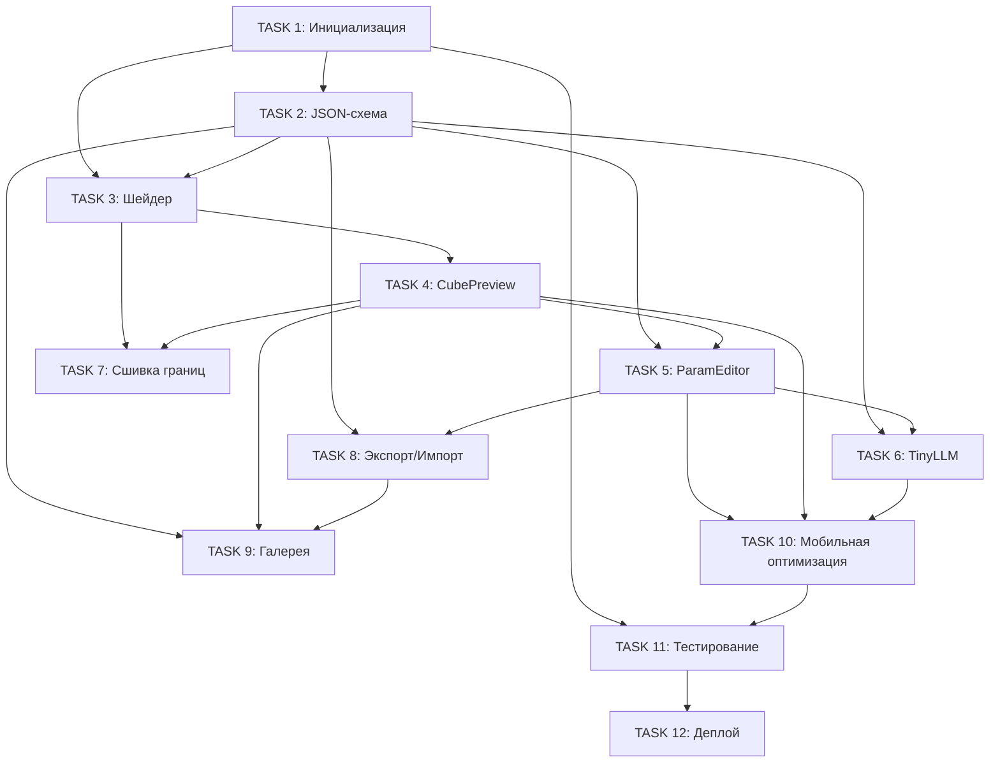

# Фаза 1: MVP с параметрическим подходом

Данный документ содержит подробное описание задач для реализации веб-прототипа редактора isocubic.

**Статус**: Завершена

---

## Обзор

**Цель**: Создать минимально жизнеспособный продукт (MVP) — веб-редактор одного параметрического кубика с возможностью генерации по текстовому промпту.

**Основные требования**:
- Параметрический подход (градиенты + шум)
- Производительность 60 FPS на мобильных устройствах
- Интуитивный интерфейс для художников
- Интеграция с ИИ для генерации по промпту
- Экспорт в JSON для дальнейшего использования

---

## Последовательность TASK

### TASK 1: Инициализация проекта и базовая структура

**Заголовок**: `Инициализация проекта: настройка окружения и структуры каталогов`

**Описание**:
Настроить базовую структуру веб-проекта для редактора isocubic.

**Задачи**:
- [x] Создать React-приложение с Vite
- [x] Настроить TypeScript
- [x] Установить зависимости: Three.js, @react-three/fiber, @react-three/drei
- [x] Настроить Tailwind CSS для стилизации
- [x] Создать структуру каталогов
- [x] Настроить ESLint и Prettier
- [x] Создать базовый CI/CD pipeline (GitHub Actions)

**Критерии приёмки**:
- Проект запускается командой `npm run dev`
- TypeScript компилируется без ошибок
- Отображается пустая страница с заголовком "isocubic"

**Метки**: `setup`, `infrastructure`

---

### TASK 2: Определение JSON-схемы для конфигурации кубика

**Заголовок**: `Создание JSON-схемы SpectralCube для параметрических кубиков`

**Описание**:
Разработать и документировать JSON-схему для хранения конфигурации параметрических кубиков.

**Задачи**:
- [x] Создать файл `/src/types/cube-schema.json` с JSON Schema Draft-07
- [x] Определить основные свойства: `id`, `prompt`, `base`, `gradients`, `noise`, `physics`, `meta`
- [x] Создать TypeScript-типы на основе схемы (`/src/types/cube.ts`)
- [x] Добавить валидатор схемы с использованием Ajv
- [x] Создать примеры конфигов в `/examples`

**Критерии приёмки**:
- Схема валидирует корректные конфиги
- TypeScript-типы согласованы со схемой
- Есть минимум 3 примера конфигов (камень, дерево, металл)

**Метки**: `schema`, `types`

---

### TASK 3: Реализация базового шейдера для параметрического куба

**Заголовок**: `Реализация GLSL-шейдера для параметрического рендеринга куба`

**Описание**:
Создать базовый шейдер, который рендерит куб с градиентами и процедурным шумом.

**Задачи**:
- [x] Создать файл `/src/shaders/parametric-cube.glsl`
- [x] Реализовать vertex shader с передачей позиции и нормали
- [x] Реализовать fragment shader с поддержкой градиентов и Perlin noise
- [x] Интегрировать шейдер с Three.js через ShaderMaterial
- [x] Создать React-компонент `ParametricCube`

**Критерии приёмки**:
- Куб рендерится с применением всех параметров из конфига
- Изменение параметров мгновенно отражается на визуализации
- FPS >= 60 на десктопе

**Метки**: `shader`, `rendering`

---

### TASK 4: Создание 3D-превью компонента

**Заголовок**: `Создание React-компонента CubePreview для 3D-визуализации`

**Описание**:
Разработать компонент для интерактивного 3D-превью параметрического куба.

**Задачи**:
- [x] Создать компонент `/src/components/CubePreview.tsx`
- [x] Настроить Three.js Canvas с OrbitControls
- [x] Добавить освещение (ambient, directional, point)
- [x] Реализовать интеграцию с ParametricCube
- [x] Добавить сетку (grid) для ориентации в пространстве
- [x] Реализовать изменение размера viewport

**Критерии приёмки**:
- Куб отображается и вращается мышью/тачем
- Освещение корректно работает со всех углов
- Компонент адаптивен к размеру контейнера

**Метки**: `ui`, `3d`, `component`

---

### TASK 5: Разработка UI редактора параметров

**Заголовок**: `Создание панели редактирования параметров кубика`

**Описание**:
Разработать интерфейс для ручной настройки параметров кубика.

**Задачи**:
- [x] Создать компонент `/src/components/ParamEditor.tsx`
- [x] Реализовать редактор базовых свойств (color picker, слайдеры)
- [x] Реализовать редактор градиентов
- [x] Реализовать редактор шума
- [x] Реализовать редактор физики
- [x] Добавить кнопку сброса к значениям по умолчанию

**Критерии приёмки**:
- Все параметры редактируемы через UI
- Изменения применяются в реальном времени
- UI адаптивен для мобильных устройств

**Метки**: `ui`, `component`, `editor`

---

### TASK 6: Интеграция TinyLLM для генерации по промпту

**Заголовок**: `Интеграция TinyLLM для генерации конфига по текстовому описанию`

**Описание**:
Реализовать клиентскую генерацию параметров кубика по текстовому промпту с использованием TinyLLM.

**Задачи**:
- [x] Исследовать варианты легковесных LLM для браузера
- [x] Создать модуль `/src/lib/tinyLLM.ts`
- [x] Создать компонент `/src/components/PromptGenerator.tsx`
- [x] Добавить fallback для устройств без поддержки
- [x] Создать набор тестовых промптов для валидации

**Критерии приёмки**:
- Генерация работает offline после загрузки модели
- Время генерации < 5 секунд на среднем устройстве
- Результат проходит валидацию по JSON-схеме

**Метки**: `ai`, `llm`, `generation`

---

### TASK 7: Реализация сшивки границ кубиков

**Заголовок**: `Реализация бесшовной сшивки границ между соседними кубиками`

**Описание**:
Обеспечить плавный переход между соседними кубиками через глобальную параметризацию.

**Задачи**:
- [x] Модифицировать шейдер для поддержки глобальных координат
- [x] Реализовать непрерывный шум
- [x] Создать компонент `/src/components/CubeGrid.tsx`
- [x] Добавить параметры сшивки в JSON-схему

**Критерии приёмки**:
- Границы между кубиками визуально незаметны
- Шум непрерывен на стыках
- Градиенты плавно переходят между кубиками

**Метки**: `shader`, `rendering`, `seams`

---

### TASK 8: Экспорт и импорт конфигов

**Заголовок**: `Реализация экспорта/импорта конфигурации кубиков`

**Описание**:
Добавить возможность сохранения и загрузки конфигов кубиков.

**Задачи**:
- [x] Создать модуль `/src/lib/storage.ts`
- [x] Создать компонент `/src/components/ExportPanel.tsx`
- [x] Реализовать автосохранение
- [x] Добавить историю изменений (undo/redo)

**Критерии приёмки**:
- Экспортированный JSON валиден по схеме
- Импорт работает с любым валидным конфигом
- Автосохранение не влияет на производительность

**Метки**: `storage`, `export`, `import`

---

### TASK 9: Галерея примеров кубиков

**Заголовок**: `Создание галереи предустановленных примеров кубиков`

**Описание**:
Разработать галерею с готовыми примерами для быстрого старта.

**Задачи**:
- [x] Создать набор примеров (минимум 10)
- [x] Создать компонент `/src/components/Gallery.tsx`
- [x] Добавить поиск по тегам
- [x] Реализовать сохранение пользовательских кубиков в галерею

**Критерии приёмки**:
- Все примеры отображаются корректно
- Выбор примера загружает его в редактор
- Поиск работает быстро (< 100ms)

**Метки**: `ui`, `gallery`, `examples`

---

### TASK 10: Адаптивная вёрстка и мобильная оптимизация

**Заголовок**: `Адаптивная вёрстка и оптимизация для мобильных устройств`

**Описание**:
Обеспечить корректную работу редактора на мобильных устройствах.

**Задачи**:
- [x] Реализовать responsive layout
- [x] Оптимизировать touch-управление
- [x] Оптимизировать производительность
- [x] Добавить PWA-манифест

**Критерии приёмки**:
- 60 FPS на iPhone 12 и аналогах
- UI удобен для touch-взаимодействия
- Приложение устанавливается как PWA

**Метки**: `mobile`, `performance`, `pwa`

---

### TASK 11: Тестирование и документация

**Заголовок**: `Написание тестов и документации для MVP`

**Описание**:
Покрыть код тестами и создать документацию для разработчиков.

**Задачи**:
- [x] Написать unit-тесты
- [x] Написать integration-тесты
- [x] Написать e2e-тесты
- [x] Создать документацию

**Критерии приёмки**:
- Code coverage >= 70%
- Все тесты проходят в CI
- Документация актуальна и полна

**Метки**: `testing`, `documentation`

---

### TASK 12: Деплой MVP

**Заголовок**: `Настройка деплоя MVP на GitHub Pages / Vercel`

**Описание**:
Настроить автоматический деплой приложения.

**Задачи**:
- [x] Настроить GitHub Actions для деплоя
- [x] Настроить альтернативный деплой на Vercel
- [x] Настроить домен (опционально)
- [x] Добавить аналитику
- [x] Создать landing page

**Критерии приёмки**:
- Приложение доступно по публичному URL
- Автодеплой работает при merge в main
- Время загрузки < 3 секунд на 4G

**Метки**: `deployment`, `ci-cd`

---

## Диаграмма зависимостей

---

## Оценка объёма работ

| TASK | Сложность | Приоритет |
|------|-----------|-----------|
| 1. Инициализация | Низкая | Критический |
| 2. JSON-схема | Низкая | Критический |
| 3. Шейдер | Высокая | Критический |
| 4. CubePreview | Средняя | Критический |
| 5. ParamEditor | Средняя | Критический |
| 6. TinyLLM | Высокая | Высокий |
| 7. Сшивка границ | Средняя | Высокий |
| 8. Экспорт/Импорт | Низкая | Средний |
| 9. Галерея | Низкая | Средний |
| 10. Мобильная оптимизация | Средняя | Высокий |
| 11. Тестирование | Средняя | Высокий |
| 12. Деплой | Низкая | Критический |

---

**Назад к [README](../../README.md)**
