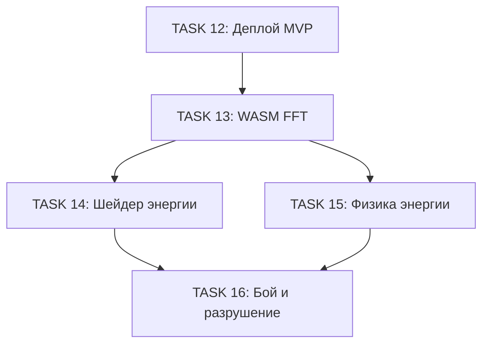

# Фаза 2: FFT для магических объектов

Данный документ содержит подробное описание задач для реализации системы FFT/энергетической визуализации для магических объектов.

**Статус**: Завершена

---

## Обзор

**Цель**: Добавить поддержку FFT-подхода для создания магических объектов с динамическими эффектами и физикой энергии.

**Основные требования**:
- WASM-модуль для высокопроизводительных FFT-вычислений
- Шейдер для визуализации энергетических полей
- Система физики с сохранением и передачей энергии
- Интеграция с системой боя и разрушения объектов

---

## Последовательность TASK

### TASK 13: WASM-модуль для FFT

**Заголовок**: `Реализация WASM-модуля для 3D FFT вычислений`

**Описание**:
Создать высокопроизводительный WASM-модуль на Rust для выполнения 3D FFT преобразований в браузере.

**Задачи**:
- [x] Настроить Rust toolchain с wasm-pack
- [x] Создать структуру проекта в `/wasm-fft`
- [x] Реализовать 3D FFT с использованием rustfft
- [x] Создать TypeScript-биндинги для WASM-модуля
- [x] Реализовать кэширование планов FFT
- [x] Добавить fallback на JavaScript
- [x] Написать unit-тесты

**Критерии приёмки**:
- FFT 8x8x8 выполняется < 1ms на среднем устройстве
- WASM-модуль загружается < 50KB (gzipped)
- Результаты FFT математически корректны

**Метки**: `wasm`, `fft`, `performance`

---

### TASK 14: Шейдер энергетической визуализации

**Заголовок**: `Реализация GLSL-шейдера для визуализации энергетических полей`

**Описание**:
Создать шейдер для рендеринга кубиков с энергетической визуализацией на основе FFT-коэффициентов.

**Задачи**:
- [x] Создать файл `/src/shaders/energy-cube.glsl`
- [x] Реализовать vertex shader
- [x] Реализовать fragment shader с реконструкцией волновой функции
- [x] Создать TypeScript-модуль `/src/shaders/energy-cube.ts`
- [x] Реализовать React-компонент `EnergyCube`
- [x] Добавить uniforms для динамического управления

**Критерии приёмки**:
- Энергетические поля визуализируются корректно
- Анимация плавная (60 FPS)
- Переход между режимами плавный

**Метки**: `shader`, `rendering`, `energy`

---

### TASK 15: Физика энергии

**Заголовок**: `Реализация системы физики энергии для магических объектов`

**Описание**:
Создать модуль для моделирования физики энергии — сохранение, передача между кубиками и потери при взаимодействиях.

**Задачи**:
- [x] Создать модуль `/src/lib/energyPhysics.ts`
- [x] Расширить JSON-схему для энергетических кубиков
- [x] Создать TypeScript-типы для `FFTCube`
- [x] Реализовать функции взаимодействия
- [x] Написать unit-тесты

**Критерии приёмки**:
- Энергия сохраняется при передаче
- Потери когерентности моделируются корректно
- Разрушение происходит при превышении порога

**Метки**: `physics`, `energy`, `types`

---

### TASK 16: Интеграция с системой боя и разрушения

**Заголовок**: `Интеграция энергетической физики с визуализацией разрушения`

**Описание**:
Связать систему энергетической физики с визуальными эффектами для демонстрации боя и разрушения.

**Задачи**:
- [x] Создать компонент `/src/components/MagicCubeDemo.tsx`
- [x] Реализовать эффект разрушения
- [x] Создать демо-сцену с несколькими кубиками
- [x] Добавить примеры магических кубиков в галерею
- [x] Обновить документацию

**Критерии приёмки**:
- Демонстрация работает без лагов
- Эффекты разрушения визуально впечатляющие
- Физика энергии понятна пользователю

**Метки**: `ui`, `demo`, `effects`, `combat`

---

## Диаграмма зависимостей

---

## Оценка объёма работ

| TASK | Сложность | Приоритет |
|------|-----------|-----------|
| 13. WASM FFT | Высокая | Критический |
| 14. Шейдер энергии | Высокая | Критический |
| 15. Физика энергии | Средняя | Высокий |
| 16. Бой и разрушение | Средняя | Высокий |

---

**Назад к [README](../../README.md)**
