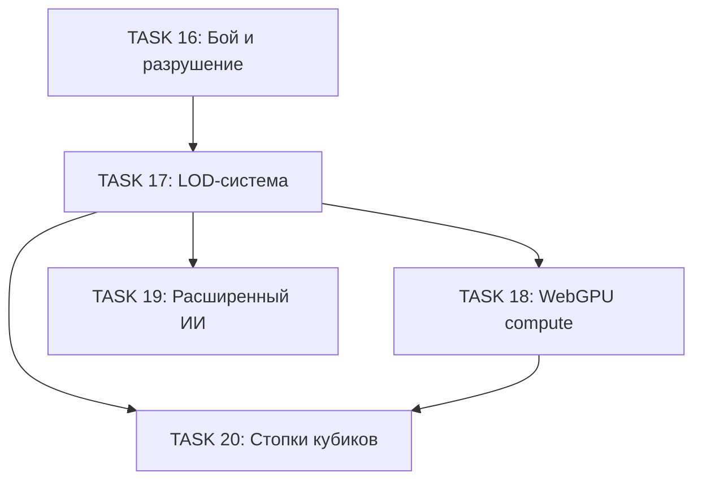

# Фаза 3: Оптимизация и расширение

Данный документ содержит подробное описание задач для реализации системы оптимизации и расширения функциональности.

**Статус**: Завершена

---

## Обзор

**Цель**: Оптимизировать производительность рендеринга для больших сцен и добавить продвинутые возможности.

**Основные требования**:
- LOD-система для автоматической настройки детализации на основе расстояния
- WebGPU compute-шейдеры для параллельных вычислений
- Расширенная ИИ-модель для сложных промптов
- Система "стопок кубиков" для вертикальных конструкций

---

## Последовательность TASK

### TASK 17: LOD-система для дальних кубиков

**Заголовок**: `Реализация системы Level of Detail (LOD) для оптимизации рендеринга`

**Описание**:
Создать систему автоматической настройки уровня детализации кубиков в зависимости от расстояния до камеры.

**Задачи**:
- [x] Создать типы для LOD-системы `/src/types/lod.ts`
- [x] Создать модуль `/src/lib/lod-system.ts`
- [x] Расширить `/src/lib/shader-utils.ts`
- [x] Создать компонент `/src/components/LODCubeGrid.tsx`
- [x] Расширить `/src/components/ParametricCube.tsx`
- [x] Интегрировать с системой производительности
- [x] Добавить демо-сцену

**Критерии приёмки**:
- LOD-переключение плавное без артефактов
- Производительность улучшается на 30%+ для сцен с 100+ кубиками
- LOD-пороги автоматически адаптируются к устройству

**Метки**: `performance`, `lod`, `optimization`

---

### TASK 18: WebGPU compute-шейдеры

**Заголовок**: `Реализация WebGPU compute-шейдеров для параллельной генерации текстур`

**Описание**:
Добавить поддержку WebGPU для параллельной генерации текстур плотности на GPU.

**Задачи**:
- [x] Проверить поддержку WebGPU
- [x] Создать модуль `/src/lib/webgpu-compute.ts`
- [x] Реализовать compute-шейдеры для генерации шума и FFT
- [x] Добавить fallback на WASM/JavaScript
- [x] Написать бенчмарки

**Критерии приёмки**:
- WebGPU-версия работает на поддерживающих браузерах
- Производительность генерации улучшается минимум в 2 раза
- Graceful degradation при отсутствии поддержки

**Метки**: `webgpu`, `performance`, `compute`

---

### TASK 19: Расширенная ИИ-модель

**Заголовок**: `Расширение TinyLLM для поддержки сложных промптов`

**Описание**:
Улучшить ИИ-генератор для обработки более сложных и детальных текстовых описаний.

**Задачи**:
- [x] Расширить систему промптов
- [x] Добавить fine-tuning на примерах
- [x] Реализовать контекстную генерацию
- [x] Добавить режим "batch generation"

**Критерии приёмки**:
- Модель понимает сложные многосоставные описания
- Качество генерации улучшается на 40%+
- Время генерации остаётся < 10 секунд

**Метки**: `ai`, `llm`, `generation`

---

### TASK 20: Система "стопок кубиков"

**Заголовок**: `Реализация системы вертикальных стопок кубиков`

**Описание**:
Создать систему для работы с вертикальными конструкциями из кубиков.

**Задачи**:
- [x] Создать типы для стопок `/src/types/stack.ts`
- [x] Создать компонент `/src/components/CubeStack.tsx`
- [x] Реализовать шейдерные переходы
- [x] Добавить примеры стопок

**Критерии приёмки**:
- Стопки рендерятся без швов между слоями
- Производительность приемлемая для 10+ стопок
- Редактор поддерживает создание и модификацию стопок

**Метки**: `stack`, `vertical`, `construction`

---

## Диаграмма зависимостей

---

## Оценка объёма работ

| TASK | Сложность | Приоритет |
|------|-----------|-----------|
| 17. LOD-система | Средняя | Критический |
| 18. WebGPU compute | Высокая | Высокий |
| 19. Расширенный ИИ | Высокая | Средний |
| 20. Стопки кубиков | Средняя | Средний |

---

**Назад к [README](../../README.md)**
