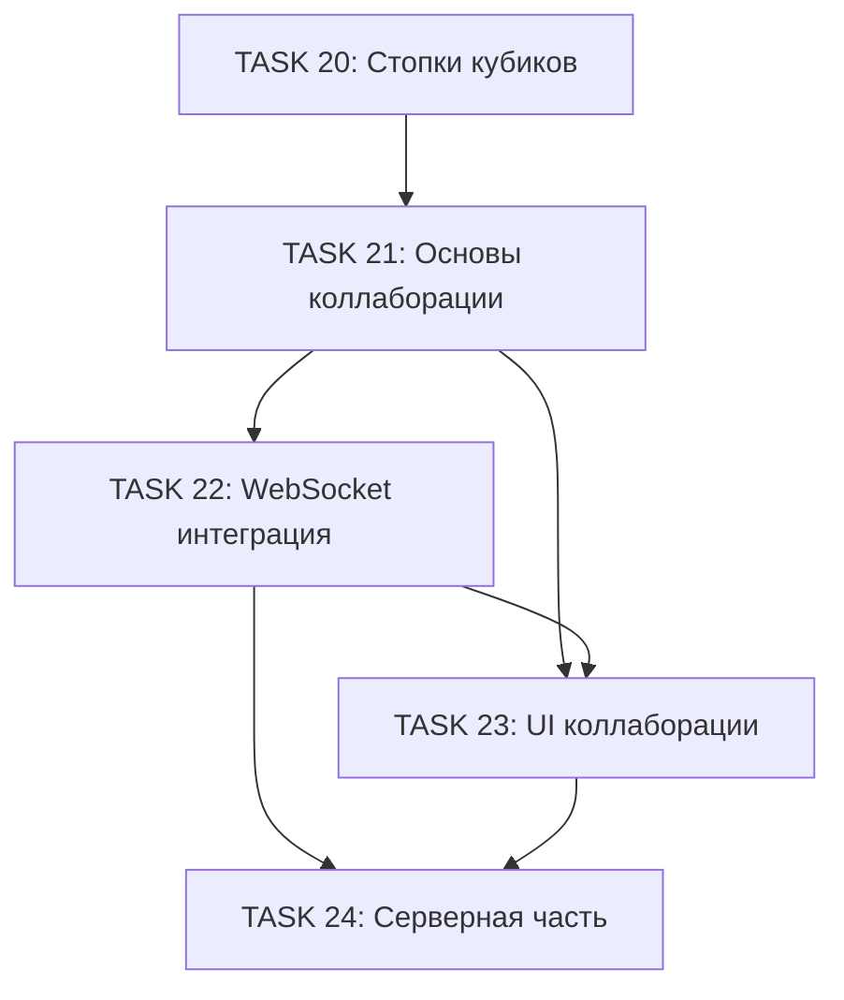

# Фаза 4: Мультиплеер и коллаборация

Данный документ содержит подробное описание задач для реализации мультиплеерной системы и коллаборативного редактирования.

**Статус**: Завершена

---

## Обзор

**Цель**: Добавить поддержку совместной работы над кубиками, включая реальное время синхронизации и управление сессиями.

**Основные требования**:
- Система сессий для совместной работы
- Реальное время синхронизации состояния
- Управление правами и ролями участников
- Оптимистичное обновление UI
- WebSocket/WebRTC коммуникация

---

## Последовательность TASK

### TASK 21: Основы коллаборативной архитектуры

**Заголовок**: `Реализация базовой архитектуры для коллаборативного редактирования`

**Описание**:
Создать фундаментальную инфраструктуру для поддержки совместной работы над кубиками.

**Задачи**:
- [x] Создать типы для коллаборации `/src/types/collaboration.ts`
- [x] Создать модуль `/src/lib/collaboration.ts`
- [x] Создать хранилище для коллаборативного состояния
- [x] Написать unit-тесты

**Критерии приёмки**:
- Типы покрывают все сценарии коллаборации
- Сессия создаётся и управляется корректно
- Конфликты разрешаются предсказуемо
- Тесты проходят с покрытием >= 80%

**Метки**: `multiplayer`, `collaboration`, `foundation`

---

### TASK 22: WebSocket интеграция

**Заголовок**: `Реализация WebSocket клиента для реального времени синхронизации`

**Описание**:
Добавить WebSocket клиент для реального времени обмена данными между участниками сессии.

**Задачи**:
- [x] Создать модуль `/src/lib/websocket-client.ts`
- [x] Создать протокол сообщений
- [x] Интегрировать с collaboration модулем
- [x] Добавить fallback на polling
- [x] Написать интеграционные тесты

**Критерии приёмки**:
- WebSocket соединение устанавливается стабильно
- Реконнект работает при потере связи
- Сообщения доставляются в реальном времени
- Fallback на polling работает корректно

**Метки**: `multiplayer`, `websocket`, `realtime`

---

### TASK 23: UI для совместной работы

**Заголовок**: `Создание UI компонентов для коллаборативного режима`

**Описание**:
Разработать интерфейс для отображения участников, курсоров и действий в реальном времени.

**Задачи**:
- [x] Создать компонент `/src/components/SessionPanel.tsx`
- [x] Создать компонент `/src/components/ParticipantCursor.tsx`
- [x] Создать компонент `/src/components/ActionHistory.tsx`
- [x] Интегрировать с основным приложением

**Критерии приёмки**:
- UI интуитивен и отзывчив
- Курсоры отображаются плавно
- История действий обновляется в реальном времени
- Мобильная версия адаптивна

**Метки**: `ui`, `collaboration`, `components`

---

### TASK 24: Серверная часть

**Заголовок**: `Создание серверной части для координации мультиплеера`

**Описание**:
Разработать минимальный сервер для координации сессий.

**Задачи**:
- [x] Оценить варианты реализации
- [x] Реализовать выбранное решение
- [x] Документировать API и развёртывание
- [x] Добавить аутентификацию сессий

**Критерии приёмки**:
- Сервер стабильно работает
- Документация полная
- Развёртывание автоматизировано

**Метки**: `backend`, `infrastructure`

---

## Диаграмма зависимостей

---

## Оценка объёма работ

| TASK | Сложность | Приоритет |
|------|-----------|-----------|
| 21. Основы коллаборации | Средняя | Критический |
| 22. WebSocket интеграция | Высокая | Высокий |
| 23. UI коллаборации | Средняя | Высокий |
| 24. Серверная часть | Высокая | Средний |

---

**Назад к [README](../../README.md)**
