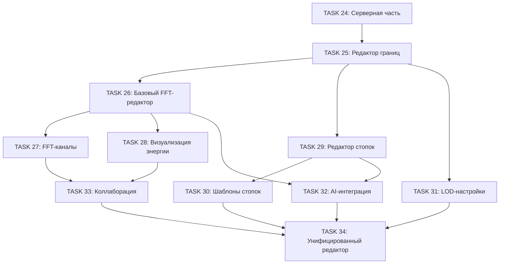

# Фаза 5: Расширение редактора параметров

Данный документ содержит подробное описание задач для расширения ParamEditor для поддержки всех нововведений из предыдущих фаз.

**Статус**: Завершена

---

## Обзор

**Цель**: Расширить редактор параметров ParamEditor для полной поддержки всех функций, реализованных в Фазах 1-4: FFT/энергетические кубики, границы сшивки, стопки кубиков, LOD-система, и расширенная AI-генерация.

**Основные требования**:
- Поддержка редактирования FFT-кубиков (магических объектов)
- Редактирование настроек границ и сшивки
- Редактирование стопок кубиков (слои, переходы)
- Настройки LOD-системы
- Интеграция с расширенной AI-генерацией
- Улучшение UX для работы с коллаборацией

---

## Последовательность TASK

### TASK 25: Редактор настроек границ (Boundary Editor)

**Заголовок**: `Добавление секции редактирования настроек границ в ParamEditor`

**Описание**:
Добавить в ParamEditor секцию для редактирования параметров сшивки границ кубиков.

**Задачи**:
- [x] Расширить `ParamEditor.tsx` новой секцией "Boundary Settings"
- [x] Добавить визуальную подсказку
- [x] Создать callback `updateBoundary`
- [x] Добавить тесты

**Критерии приёмки**:
- Пользователь может изменять режим границ через UI
- Изменения применяются в реальном времени
- Значения по умолчанию соответствуют CUBE_DEFAULTS.boundary

**Метки**: `ui`, `editor`, `boundary`

---

### TASK 26: Базовый редактор FFT-кубиков

**Заголовок**: `Создание редактора для магических/энергетических кубиков`

**Описание**:
Создать новый режим редактора для работы с FFT-кубиками.

**Задачи**:
- [x] Создать компонент FFTParamEditor или расширить ParamEditor
- [x] Секция "FFT Physics"
- [x] Интеграция с energyPhysics.ts
- [x] Добавить типы и интерфейсы
- [x] Написать тесты

**Критерии приёмки**:
- Пользователь может переключаться между режимами
- Все FFT-параметры редактируемы
- Индикаторы энергии обновляются в реальном времени

**Метки**: `ui`, `editor`, `fft`, `energy`

---

### TASK 27: Редактор FFT-каналов

**Заголовок**: `Создание расширенного редактора FFT-коэффициентов по каналам`

**Описание**:
Добавить возможность редактирования FFT-коэффициентов для каждого канала (R, G, B, A).

**Задачи**:
- [x] Создать компонент FFTChannelEditor
- [x] Добавить визуализацию спектра
- [x] Создать пресеты коэффициентов
- [x] Написать тесты

**Критерии приёмки**:
- Все FFT-коэффициенты редактируемы через UI
- Визуализация спектра обновляется в реальном времени
- Пресеты применяются корректно

**Метки**: `ui`, `editor`, `fft`, `advanced`

---

### TASK 28: Редактор визуализации энергии

**Заголовок**: `Добавление настроек визуализации в редактор энергетических кубиков`

**Описание**:
Добавить секцию для управления параметрами визуализации энергетических кубиков.

**Задачи**:
- [x] Расширить FFT-редактор секцией "Visualization"
- [x] Секция "Animation"
- [x] Добавить предпросмотр эффектов
- [x] Написать тесты

**Критерии приёмки**:
- Все параметры визуализации редактируемы
- Предпросмотр обновляется мгновенно
- Анимация включается/выключается через UI

**Метки**: `ui`, `editor`, `visualization`, `energy`

---

### TASK 29: Редактор стопок кубиков

**Заголовок**: `Создание редактора для вертикальных стопок кубиков`

**Описание**:
Создать редактор для работы со стопками кубиков.

**Задачи**:
- [x] Создать компонент `/src/components/StackEditor.tsx`
- [x] Редактор слоя (StackLayer)
- [x] Редактор переходов (StackTransition)
- [x] Секция "Stack Physics"
- [x] Написать тесты

**Критерии приёмки**:
- Пользователь может создавать и редактировать стопки
- Слои можно перетаскивать
- Переходы между слоями настраиваются

**Метки**: `ui`, `editor`, `stack`, `layers`

---

### TASK 30: Шаблоны стопок

**Заголовок**: `Добавление готовых шаблонов стопок в редактор`

**Описание**:
Создать библиотеку готовых шаблонов стопок для быстрого старта.

**Задачи**:
- [x] Создать модуль `/src/lib/stack-presets.ts`
- [x] Создать компонент `/src/components/StackPresetPicker.tsx`
- [x] Интегрировать с StackEditor
- [x] Написать тесты

**Критерии приёмки**:
- Минимум 5 пресетов доступно
- Пресеты применяются одним кликом
- Пользователь может сохранять свои пресеты

**Метки**: `ui`, `presets`, `stack`

---

### TASK 31: Настройки LOD в редакторе

**Заголовок**: `Добавление редактора LOD-настроек для оптимизации производительности`

**Описание**:
Добавить секцию для настройки LOD-параметров в ParamEditor.

**Задачи**:
- [x] Создать секцию "LOD Settings" в ParamEditor
- [x] Создать компонент `/src/components/LODConfigEditor.tsx`
- [x] Добавить предпросмотр LOD-эффекта
- [x] Интегрировать с useLODStatistics hook
- [x] Написать тесты

**Критерии приёмки**:
- Пользователь может настраивать LOD-параметры
- Быстрые пресеты работают корректно
- Предпросмотр показывает влияние настроек

**Метки**: `ui`, `editor`, `lod`, `performance`

---

### TASK 32: Интеграция расширенного AI в редактор

**Заголовок**: `Расширение AI-генератора для поддержки композитных описаний и контекста`

**Описание**:
Интегрировать расширенные возможности AI-генерации в редактор.

**Задачи**:
- [x] Расширить `/src/components/PromptGenerator.tsx`
- [x] Добавить контекстную генерацию
- [x] Интегрировать с CubeGrid/CubeStack
- [x] Написать тесты

**Критерии приёмки**:
- Все режимы генерации доступны через UI
- Композитная генерация создаёт согласованные группы
- Контекстная генерация учитывает существующие кубики

**Метки**: `ui`, `ai`, `generation`, `composite`

---

### TASK 33: Режим коллаборативного редактирования

**Заголовок**: `Добавление индикаторов коллаборации в редактор параметров`

**Описание**:
Интегрировать ParamEditor с системой коллаборации.

**Задачи**:
- [x] Расширить ParamEditor для режима коллаборации
- [x] Добавить компонент CollaborativeParamEditor
- [x] Добавить историю изменений
- [x] Написать тесты

**Критерии приёмки**:
- Видно кто редактирует какой параметр
- Конфликты разрешаются корректно
- История изменений отображается

**Метки**: `ui`, `collaboration`, `multiplayer`

---

### TASK 34: Унифицированный редактор

**Заголовок**: `Объединение всех редакторов в единый адаптивный интерфейс`

**Описание**:
Объединить все редакторы в единый компонент с адаптивным интерфейсом.

**Задачи**:
- [x] Создать компонент `/src/components/UnifiedEditor.tsx`
- [x] Добавить вкладки для организации секций
- [x] Оптимизировать для мобильных устройств
- [x] Добавить "Quick Actions"
- [x] Написать e2e тесты

**Критерии приёмки**:
- Единый редактор для всех типов кубиков
- Интерфейс адаптивен для мобильных устройств
- Все функции предыдущих редакторов доступны
- Производительность не деградирует

**Метки**: `ui`, `editor`, `unified`, `ux`

---

## Диаграмма зависимостей

---

## Оценка объёма работ

| TASK | Сложность | Приоритет | Статус |
|------|-----------|-----------|--------|
| 25. Редактор границ | Низкая | Критический | Завершено |
| 26. Базовый FFT-редактор | Средняя | Критический | Завершено |
| 27. FFT-каналы | Высокая | Высокий | Завершено |
| 28. Визуализация энергии | Средняя | Высокий | Завершено |
| 29. Редактор стопок | Высокая | Критический | Завершено |
| 30. Шаблоны стопок | Низкая | Средний | Завершено |
| 31. LOD-настройки | Средняя | Средний | Завершено |
| 32. AI-интеграция | Высокая | Высокий | Завершено |
| 33. Коллаборация | Средняя | Средний | Завершено |
| 34. Унифицированный редактор | Высокая | Высокий | Завершено |

---

**Назад к [README](../../README.md)**
