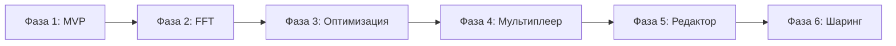

# Roadmap проекта isocubic

Данный документ содержит описание фаз разработки проекта isocubic с краткими пунктами по каждому issue.

> Подробное описание задач каждой фазы находится в отдельных файлах этой директории.

---

## Обзор фаз

| Фаза | Название | Статус | Описание |
|------|----------|--------|----------|
| 1 | [MVP](phase-1-mvp.md) | Завершена | Базовый редактор параметрических кубиков |
| 2 | [FFT для магических объектов](phase-2-fft.md) | Завершена | Энергетическая визуализация и физика |
| 3 | [Оптимизация](phase-3-optimization.md) | Завершена | LOD-система, WebGPU, расширенный ИИ |
| 4 | [Мультиплеер](phase-4-multiplayer.md) | Завершена | Совместное редактирование |
| 5 | [Расширение редактора](phase-5-editor.md) | В процессе | Расширенный ParamEditor |
| 6 | [Публикация и шаринг](phase-6-sharing.md) | В процессе | Галерея, share-ссылки |

---

## Фаза 1: MVP

**Цель**: Создать минимально жизнеспособный продукт — веб-редактор одного параметрического кубика с возможностью генерации по текстовому промпту.

**Статус**: Завершена

| Issue | Название | Статус |
|-------|----------|--------|
| 1 | Инициализация проекта | Завершено |
| 2 | JSON-схема SpectralCube | Завершено |
| 3 | GLSL-шейдер параметрического куба | Завершено |
| 4 | CubePreview компонент | Завершено |
| 5 | ParamEditor — редактор параметров | Завершено |
| 6 | Интеграция TinyLLM | Завершено |
| 7 | Сшивка границ кубиков | Завершено |
| 8 | Экспорт/импорт конфигов | Завершено |
| 9 | Галерея примеров | Завершено |
| 10 | Мобильная оптимизация | Завершено |
| 11 | Тестирование и документация | Завершено |
| 12 | Деплой MVP | Завершено |

**Подробнее**: [phase-1-mvp.md](phase-1-mvp.md)

---

## Фаза 2: FFT для магических объектов

**Цель**: Добавить поддержку FFT-подхода для создания магических объектов с динамическими эффектами и физикой энергии.

**Статус**: Завершена

| Issue | Название | Статус |
|-------|----------|--------|
| 13 | WASM-модуль для FFT | Завершено |
| 14 | Шейдер энергетической визуализации | Завершено |
| 15 | Физика энергии | Завершено |
| 16 | Интеграция с боем и разрушением | Завершено |

**Подробнее**: [phase-2-fft.md](phase-2-fft.md)

---

## Фаза 3: Оптимизация

**Цель**: Оптимизировать производительность рендеринга для больших сцен и добавить продвинутые возможности.

**Статус**: Завершена

| Issue | Название | Статус |
|-------|----------|--------|
| 17 | LOD-система | Завершено |
| 18 | WebGPU compute-шейдеры | Завершено |
| 19 | Расширенная ИИ-модель | Завершено |
| 20 | Система "стопок кубиков" | Завершено |

**Подробнее**: [phase-3-optimization.md](phase-3-optimization.md)

---

## Фаза 4: Мультиплеер и коллаборация

**Цель**: Добавить поддержку совместной работы над кубиками, включая реальное время синхронизации и управление сессиями.

**Статус**: Завершена

| Issue | Название | Статус |
|-------|----------|--------|
| 21 | Основы коллаборативной архитектуры | Завершено |
| 22 | WebSocket интеграция | Завершено |
| 23 | UI для совместной работы | Завершено |
| 24 | Серверная часть | Завершено |

**Подробнее**: [phase-4-multiplayer.md](phase-4-multiplayer.md)

---

## Фаза 5: Расширение редактора параметров

**Цель**: Расширить редактор параметров ParamEditor для полной поддержки всех функций из Фаз 1-4.

**Статус**: В процессе

| Issue | Название | Статус |
|-------|----------|--------|
| 25 | Редактор настроек границ | Завершено |
| 26 | Базовый редактор FFT-кубиков | Завершено |
| 27 | Редактор FFT-каналов | Завершено |
| 28 | Редактор визуализации энергии | Завершено |
| 29 | Редактор стопок кубиков | Завершено |
| 30 | Шаблоны стопок | Завершено |
| 31 | Настройки LOD в редакторе | Завершено |
| 32 | Интеграция расширенного AI | В работе |
| 33 | Режим коллаборативного редактирования | В работе |
| 34 | Унифицированный редактор | В работе |

**Подробнее**: [phase-5-editor.md](phase-5-editor.md)

---

## Фаза 6: Публикация и шаринг кубиков

**Цель**: Создать систему публикации и шаринга кубиков для сообщества.

**Статус**: В процессе

| Issue | Название | Статус |
|-------|----------|--------|
| 35 | Система аутентификации | В работе |
| 36 | Галерея сообщества | Планируется |
| 37 | Share-ссылки | Планируется |
| 38 | Социальные функции | Планируется |
| 39 | API для публикации | Планируется |

**Подробнее**: [phase-6-sharing.md](phase-6-sharing.md)

---

## Следующие шаги

После завершения Фазы 6 планируется:

- **Фаза 7**: Marketplace и монетизация

---

## Диаграмма зависимостей фаз

---

## Легенда статусов

| Символ | Статус |
|--------|--------|
| ✅ | Завершено |
| 🔄 | В работе |
| 📋 | Планируется |

---

## Связанные документы

- [ANALYSIS.md](../../ANALYSIS.md) — анализ подходов к реализации
- [description.md](../../description.md) — исходные идеи проекта
- [docs/API.md](../API.md) — API референс
